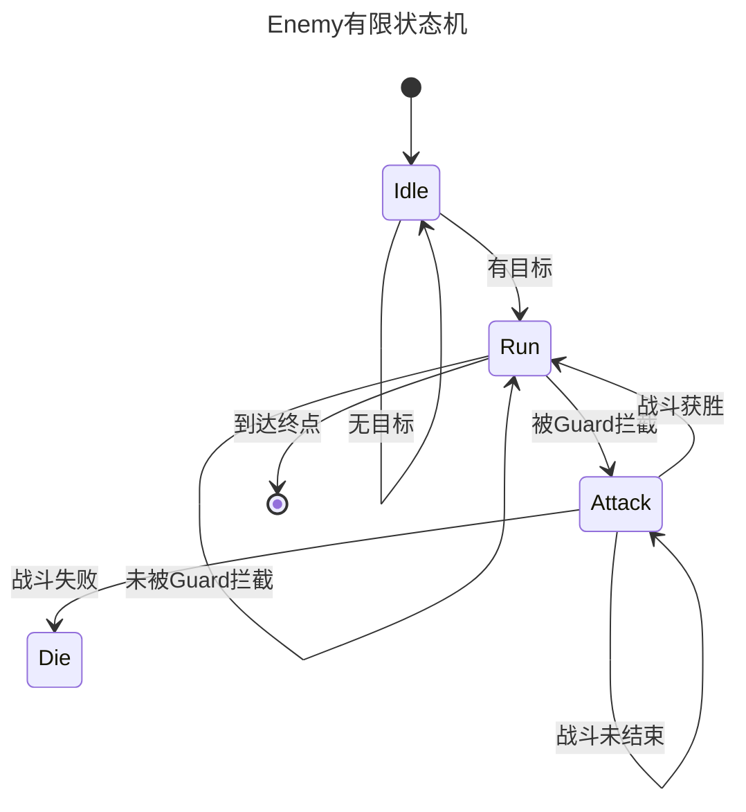
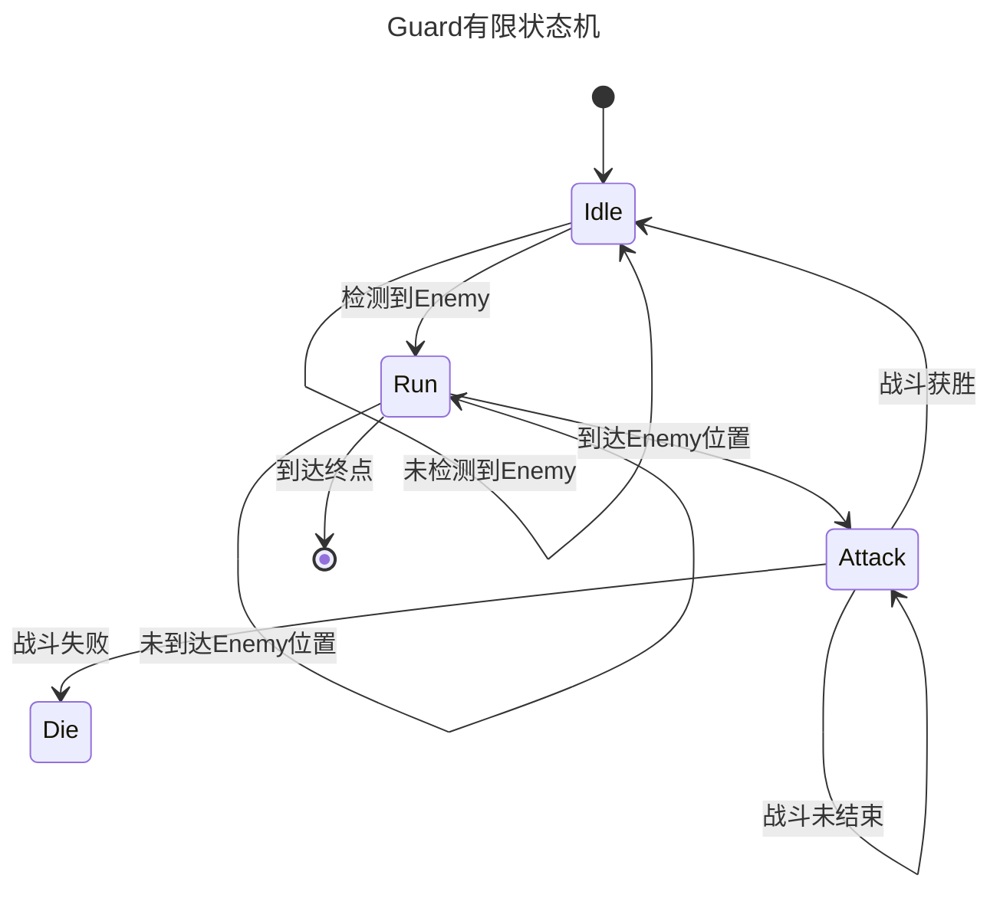

```mermaid
---
title: Enemy有限状态机
---
stateDiagram
    [*] --> Idle
    Idle --> Idle: 无目标
    Idle --> Run: 有目标
    Run --> Run: 未被Guard拦截
    Run --> Attack: 被Guard拦截
    Attack --> Run: 战斗获胜
    Attack --> Attack: 战斗未结束
    Attack --> Die: 战斗失败
    Run --> [*]: 到达终点
    


```

```mermaid
---
title: Guard有限状态机
---
stateDiagram
    [*] --> Idle
    Idle --> Idle: 未检测到Enemy
    Idle --> Run: 检测到Enemy
    Run --> Run: 未到达Enemy位置
    Run --> Attack: 到达Enemy位置
    Attack --> Idle: 战斗获胜
    Attack --> Attack: 战斗未结束
    Attack --> Die: 战斗失败
    Run --> [*]: 到达终点
```

